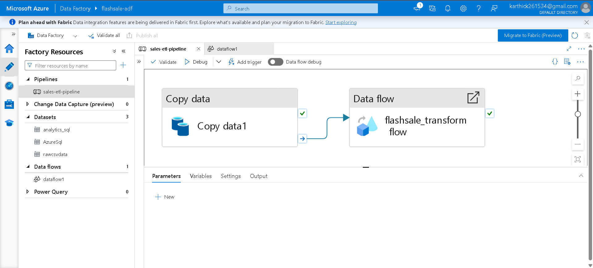
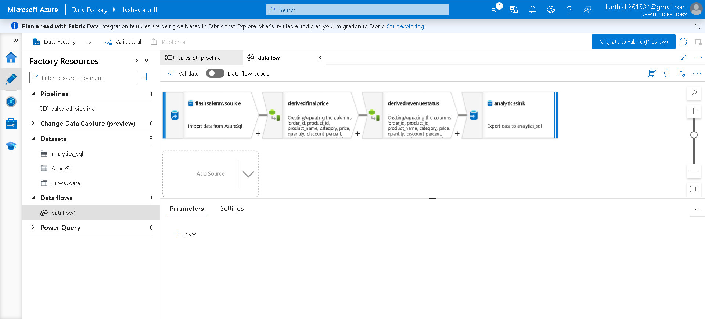
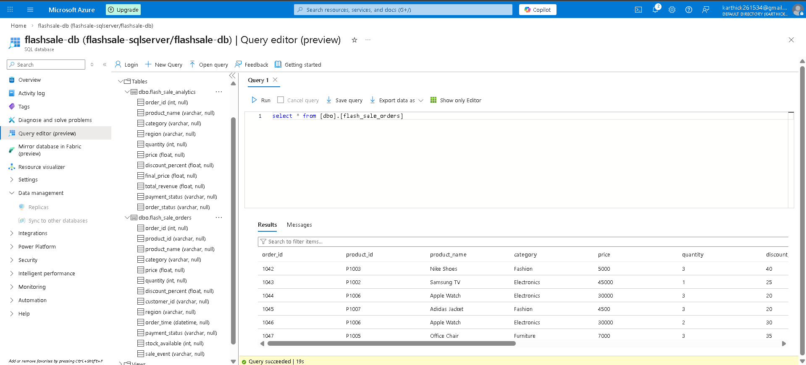
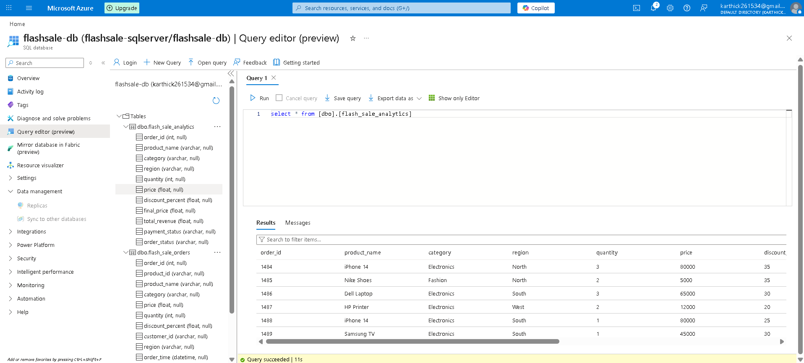
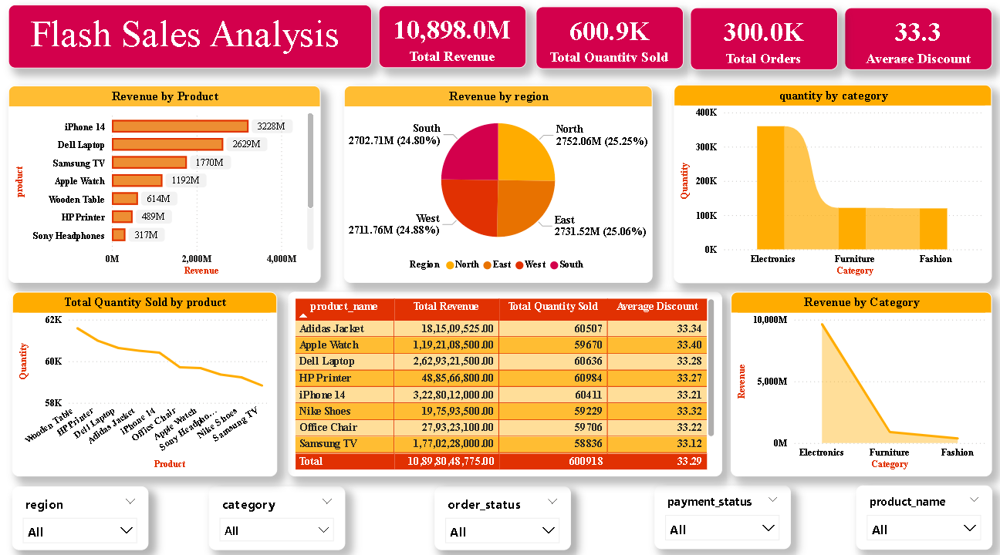

# 🚀 Flash Sale Analytics Pipeline (Azure Data Engineering Project)

This project demonstrates a **cloud-based data engineering pipeline**
built using **Microsoft Azure services and Power BI**.

The pipeline ingests raw sales data, processes it using Azure Data
Factory, stores it in Azure SQL Database, and visualizes insights using
Power BI dashboards.

------------------------------------------------------------------------

# 🏗 Architecture Diagram

### Data Flow

CSV Dataset → Azure Storage Account → Azure Data Factory → Azure SQL
Database → Power BI Dashboard

------------------------------------------------------------------------

# ⚙ Technologies Used

  Technology              Purpose
  ----------------------- --------------------
  Microsoft Azure         Cloud Platform
  Azure Storage Account   Data Lake Storage
  Azure Data Factory      ETL Pipeline
  Azure SQL Database      Data Warehouse
  Power BI                Data Visualization
  SQL                     Data Querying

------------------------------------------------------------------------

# 📂 Project Components

## 1️⃣ Data Source

Raw dataset stored as CSV file.

File: `flash_sale_orders.csv`

Contains:

-   Product Name
-   Category
-   Price
-   Quantity
-   Region
-   Discount
-   Order Details

------------------------------------------------------------------------

## 2️⃣ Azure Storage Account (Data Lake)

Raw data stored in Blob Storage container.

Container: `raw-data`

------------------------------------------------------------------------

## 3️⃣ Azure Data Factory

Azure Data Factory orchestrates the **ETL pipeline**.

Pipeline includes: - Copy Data Activity - Data Flow Transformation

------------------------------------------------------------------------

## 4️⃣ Data Flow Transformation

Data transformation calculates:

-   Final Price
-   Revenue
-   Discount analysis

------------------------------------------------------------------------

## 5️⃣ Azure SQL Database

Processed data is stored in SQL tables.

### Raw Table

`flash_sale_orders`

### Analytics Table

`flash_sale_analytics`

------------------------------------------------------------------------

## 6️⃣ Power BI Dashboard

Power BI connects to Azure SQL Database to build dashboards.

Metrics include:

-   Total Revenue
-   Total Orders
-   Total Quantity Sold
-   Average Discount

------------------------------------------------------------------------

# 📁 Azure Resource Group

All services deployed inside a single Azure Resource Group.

------------------------------------------------------------------------

# 📊 Business Insights

Using this pipeline businesses can:

-   Track flash sale performance
-   Identify top-selling products
-   Analyze regional demand
-   Monitor revenue growth
-   Improve pricing strategies

------------------------------------------------------------------------

# 🚀 Future Improvements

Possible enhancements:

-   Real-time streaming with Azure Event Hub
-   Automated pipeline triggers
-   Machine learning for sales prediction
-   Customer segmentation analytics

------------------------------------------------------------------------

# 👨‍💻 Author

**Karthick S**

------------------------------------------------------------------------

⭐ If you like this project, give it a star on GitHub!
